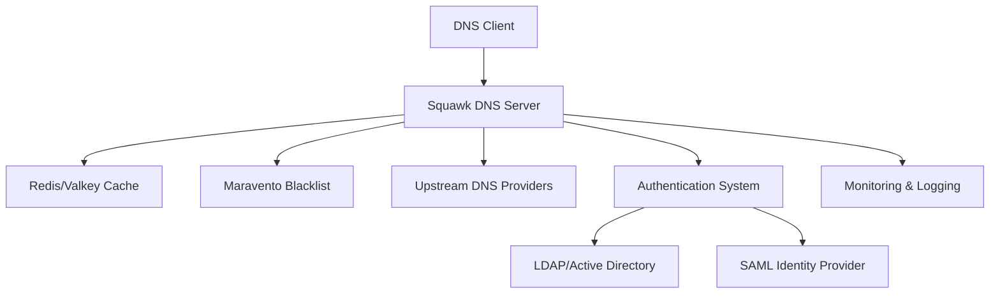

# Squawk DNS Documentation

<div class="hero-banner">
  <h2>🛡️ Squawk DNS, a Penguin Technologies Solution</h2>
  <p><strong>Secure DNS-over-HTTPS system with enterprise authentication, mTLS support, and comprehensive security features.</strong></p>
</div>

## Welcome

Welcome to the comprehensive documentation for Squawk DNS, an enterprise-grade DNS-over-HTTPS solution designed for organizations requiring secure, authenticated DNS resolution with advanced security features.

## Quick Start

Get started with Squawk DNS in minutes using Docker or native packages:

### Docker Deployment

```bash
# Server
docker run -d \
  -p 8080:8080 \
  -e PORT=8080 \
  -e AUTH_TOKEN=your-secure-token \
  penguincloud/squawk-dns-server:latest

# Client
docker run -d \
  -p 53:53/udp -p 53:53/tcp \
  -e SQUAWK_SERVER_URL=https://dns.yourdomain.com:8443 \
  -e SQUAWK_AUTH_TOKEN=your-secure-token \
  penguincloud/squawk-dns-client:latest forward -v
```

### Native Installation

```bash
# Download and install (Linux example)
wget https://github.com/penguintechinc/squawk/releases/download/v1.1.1-client/squawk-dns-client_1.1.1_amd64.deb
sudo dpkg -i squawk-dns-client_1.1.1_amd64.deb
sudo systemctl enable --now squawk-dns-client
```

## Key Features

### 🔒 Advanced Security
- **mTLS Authentication**: Certificate-based client authentication
- **DNS Security**: Maravento blacklist integration (2M+ malicious domains)
- **Threat Protection**: Real-time threat intelligence and custom filtering
- **Brute Force Protection**: Rate limiting and IP blocking

### ⚡ High Performance
- **Lightning Fast**: ~10ms Go client cold start
- **Modern Protocols**: HTTP/3 support with QUIC transport
- **Intelligent Caching**: Redis/Valkey integration
- **Resource Efficient**: 15MB memory footprint

### 🏢 Enterprise Ready
- **Identity Integration**: SAML, LDAP, OAuth2 support
- **Multi-Factor Auth**: MFA integration
- **Web Console**: Comprehensive management interface
- **Role-Based Access**: Granular permissions and auditing

### 📊 Monitoring & Analytics
- **Real-time Metrics**: Performance and security monitoring
- **Health Checks**: System tray health status
- **Syslog Integration**: Enterprise logging systems
- **Prometheus Support**: Metrics collection and alerting

## Architecture Overview

Squawk DNS is built with a modern, scalable architecture:



## Documentation Sections

| Section | Description |
|---------|-------------|
| [Usage Guide](USAGE.md) | Complete usage instructions and configuration |
| [API Documentation](API.md) | REST API reference and examples |
| [System Architecture](ARCHITECTURE.md) | Technical architecture and design decisions |
| [Token Management](TOKEN_MANAGEMENT.md) | Authentication and authorization guide |
| [Contributing](CONTRIBUTING.md) | Development and contribution guidelines |
| [Development Setup](DEVELOPMENT.md) | Local development environment setup |
| [Release Notes](RELEASE_NOTES.md) | Latest features and changes |

## Support & Community

- **GitHub Issues**: [Report bugs and feature requests](https://github.com/penguintechinc/squawk/issues)
- **Documentation**: This comprehensive guide
- **Enterprise Support**: [Contact PenguinCloud](mailto:sales@penguincloud.io)

## License

Squawk DNS is released under the [AGPL v3 License](LICENSE.md).

---

<div class="footer-note">
  <p><em>Squawk DNS is a Penguin Technologies Solution - Enterprise-grade DNS security for modern organizations.</em></p>
</div>